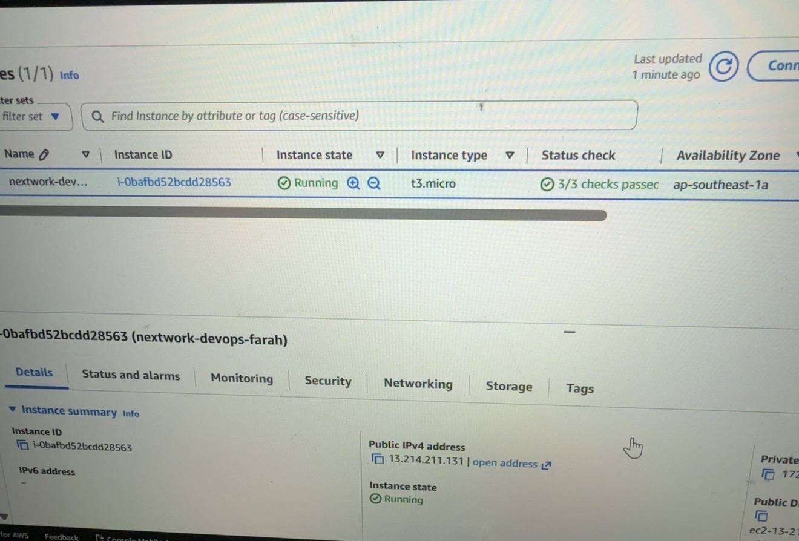
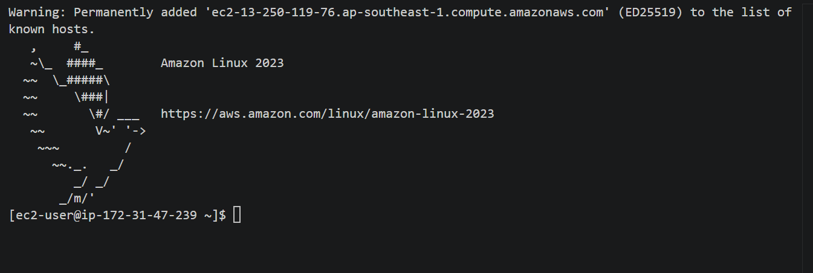
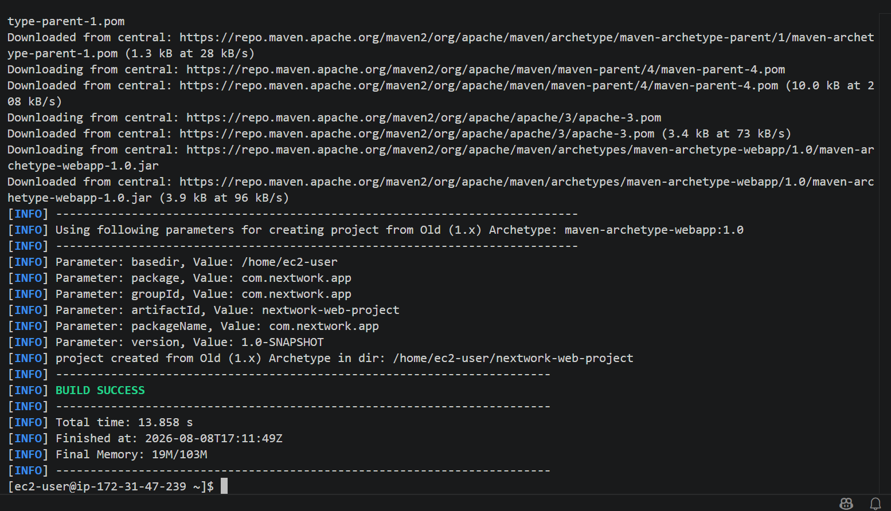
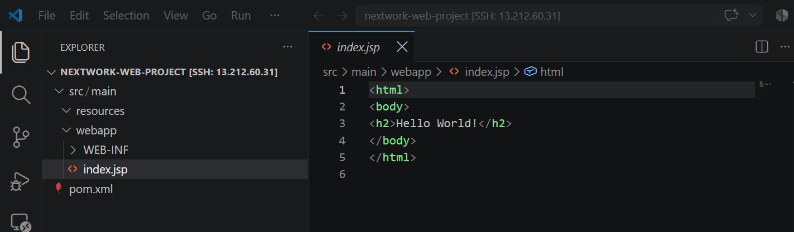
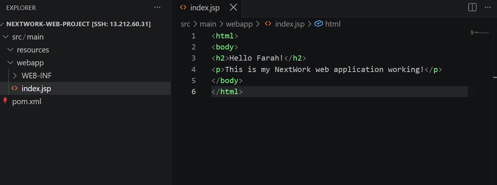
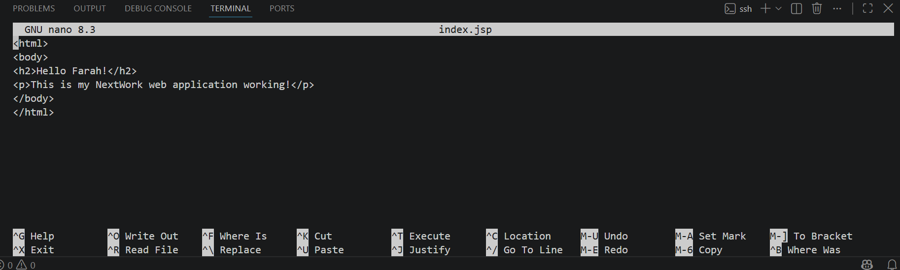
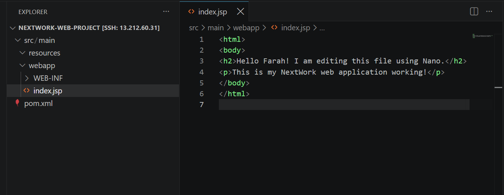

# AWS DevOps Web Application

A hands-on cloud project where I set up and configured a Java web application on Amazon EC2 using Apache Maven, Amazon Corretto 8, SSH, and Visual Studio Code Remote-SSH.

This project helped me practise working with a remote Linux server, managing application files through both an IDE and the terminal, and troubleshooting cloud infrastructure issues.

## Project Overview

In this project, I:

- Launched and configured an Amazon EC2 instance.
- Created and secured an SSH key pair.
- Connected to the EC2 instance using SSH.
- Installed Apache Maven and Amazon Corretto 8.
- Generated a Java web application using a Maven archetype.
- Connected Visual Studio Code directly to EC2 using Remote-SSH.
- Explored and edited the Maven web application structure.
- Modified `index.jsp` using VS Code.
- Edited the same file through the terminal using Nano.
- Verified the changes between the terminal and VS Code.
- Troubleshot an EC2 memory issue affecting VS Code Remote-SSH.

## Technologies & Tools

- Amazon Web Services (AWS)
- Amazon EC2
- Amazon Linux 2023
- SSH
- Visual Studio Code
- VS Code Remote-SSH
- Apache Maven
- Amazon Corretto 8 (Java)
- Linux Command Line
- Nano Text Editor

## Project Workflow

The project followed this workflow:

**Amazon EC2 → SSH Connection → Java & Maven Setup → Web App Creation → VS Code Remote-SSH → Code Editing → Terminal Editing with Nano**

I first launched an EC2 instance to provide the cloud server for the project. After connecting to the instance through SSH, I installed Java and Maven and used Maven to generate the web application.

I then connected VS Code directly to the EC2 instance using Remote-SSH, allowing me to browse and edit the application files stored on the remote server. Finally, I practised editing `index.jsp` directly from the Linux terminal using Nano.

## Project Screenshots

### 1. Amazon EC2 Instance

I launched an Amazon EC2 instance to provide the cloud server for my Java web application. The instance was running successfully and passed all status checks.

### 2. Connecting to EC2 Using SSH

I connected my local computer to the EC2 instance using SSH, allowing me to securely access and manage the remote Linux server from the terminal.

### 3. Building the Java Web Application

I used Apache Maven to generate the Java web application and verified that the project was created successfully with a `BUILD SUCCESS` result.

### 4. Exploring the Project in VS Code

Using VS Code Remote-SSH, I accessed the project files stored directly on the EC2 instance and explored the Java web application's folder structure.

### 5. Editing index.jsp

I modified the `index.jsp` file using VS Code Remote-SSH to customise the content of the Java web application.

### 6. Editing the Web App Using Nano

As an additional challenge, I edited `index.jsp` directly from the Linux terminal using the Nano text editor instead of an IDE.

This gave me hands-on practice navigating and modifying application files using command-line tools.

### 7. Verifying the Changes in VS Code

After saving the changes in Nano, I verified that the updated `index.jsp` content was immediately reflected in VS Code.

This demonstrated that both VS Code Remote-SSH and Nano were modifying the same application file stored on the EC2 instance.

## Challenges & Troubleshooting

One of the main challenges I encountered was a memory limitation on my original `t3.micro` EC2 instance. While using VS Code Remote-SSH, the instance ran out of memory and some processes were terminated by the Linux Out-of-Memory (OOM) killer.

To troubleshoot the issue, I checked the instance status and memory usage, stopped the instance, and changed the instance type from `t3.micro` to `t3.small`, increasing the available memory from 1 GiB to 2 GiB.

After restarting the instance, I verified that all EC2 status checks passed and successfully reconnected through SSH and VS Code Remote-SSH.

This experience helped me understand how compute resources such as memory can affect development tools and applications running on a cloud server.

## Key Learnings

Through this project, I gained hands-on experience with:

- Launching and managing an Amazon EC2 instance.
- Connecting securely to a cloud server using SSH.
- Navigating a Linux environment using terminal commands.
- Setting up Java and Apache Maven on a remote server.
- Understanding the basic structure of a Maven web application.
- Using VS Code Remote-SSH to work directly with files hosted on EC2.
- Editing application files using both an IDE and the Nano terminal editor.
- Troubleshooting EC2 resource limitations and understanding the impact of memory on application performance.

## Project Reflection

This project gave me practical experience in setting up and working with a cloud-based development environment. The most challenging part was troubleshooting the EC2 memory issue, but resolving it helped me understand the importance of selecting appropriate cloud resources.

The most rewarding part was successfully connecting VS Code to my EC2 instance and seeing the changes made through Nano appear directly in VS Code. It helped me better understand how local development tools can interact with files hosted on a remote cloud server.

This project also strengthened my understanding of AWS, Linux, SSH, Java, Maven, and basic DevOps workflows.
